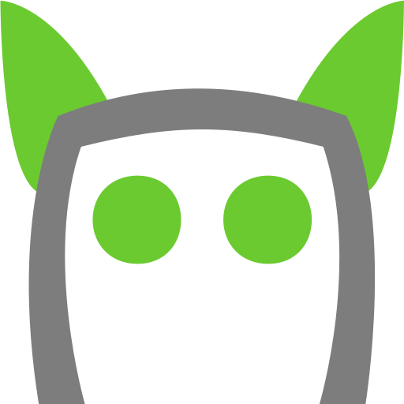

# Noodel.js

Noodel, short for *node view model*, is a beautiful, intuitive UI system for presenting
digital content as a tree of dynamic, flexible containers.

It is currently available as Noodel.js, a JavaScript plugin for use in web-based projects. 

## Demo

[See here for an interactive demo](https://js.noodel.io/demo) that showcases Noodel's main features.

## Documentation

Noodel eats its own dog food: it uses itself to present its own docs :wink:

[See the full documentation site here.](https://js.noodel.io/)

## Contribution

Contributions are most welcome! Please [see here](https://github.com/zlu883/noodel-js/blob/master/CONTRIBUTING.md) for details.

## Donate

If you find Noodel useful or inspiring, please consider supporting the author via [Paypal](https://www.paypal.com/cgi-bin/webscr?cmd=_s-xclick&hosted_button_id=5YLHMEDSS3A6W) or [Github Sponsors](https://github.com/sponsors/zlu883) :relaxed:

## License

MIT license

© 2019-present Zuohao (Jonny) Lu
